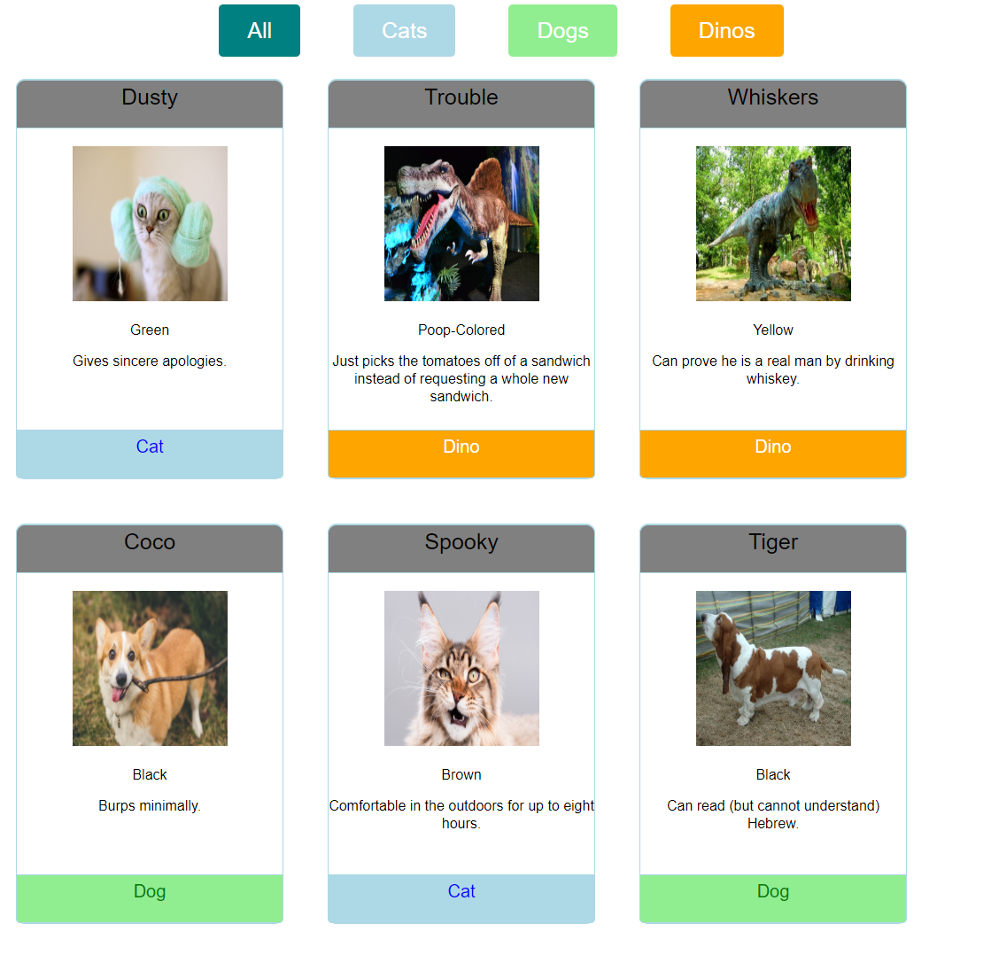

# Pet-Adoption

The point of this project was to use javascript to loop through an array and display cards for each item in it as well as styling to match a given example.

## Preview

## Technologies Used

  

## View Project

* Clone the repository `$ git clone git@github.com:spotmonk/pet-adoption.git`
* Run any HTTP server. My favorite is installed with `$ npm install http-server` and run with a `$ hs`
